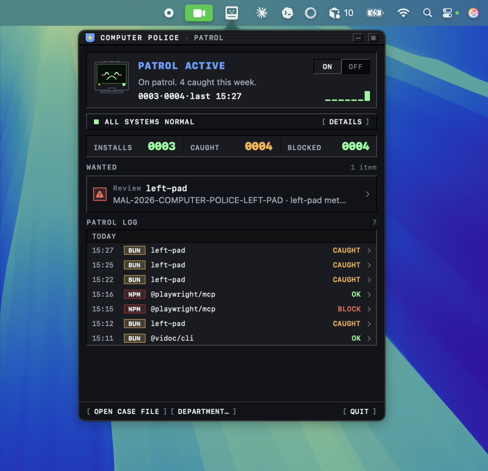

<h1 align="center">Computer Police</h1>

<p align="center"><strong>Blocks known-malicious package installs before they touch your disk.</strong></p>

<p align="center">by <a href="https://www.vidocsecurity.com/">Vidoc Security</a></p>

<p align="center">
  <a href="https://github.com/vidocsecurity/computer-police/releases/latest"></a>
  <a href="https://github.com/vidocsecurity/computer-police/actions/workflows/ci.yml"></a>
  
  
  
  <a href="LICENSE"></a>
  <a href="https://osv.dev"></a>
</p>

<p align="center">
  
</p>

---

Computer Police protects developers, CI, and coding agents from installing confirmed-malicious packages.

It runs a local registry proxy on `127.0.0.1`, points supported package managers at it, and blocks package versions listed in public [OSV](https://osv.dev) `MAL-*` malware advisories. Everything else passes through.

It is deliberately narrow: not a vulnerability scanner, not a license scanner, not a static analyzer, and not a "this package looks suspicious" heuristic. If Computer Police blocks an install, the package version is already listed as malware by a public advisory source.

## Install

Computer Police is safe to try: it runs locally, needs no root, and can be fully removed with `computer-police uninstall`.

One-liner for macOS, Linux, and Windows via WSL or Git Bash:

```bash
curl -fsSL https://computer.police.dev/install | bash
```

Pin a version:

```bash
curl -fsSL https://computer.police.dev/install | bash -s -- --version v0.1.0
```

Update or remove:

```bash
computer-police self update
computer-police self uninstall
```

The installer detects your OS and CPU, downloads the matching GitHub Release artifact, verifies SHA-256 checksums, and installs the CLI to `~/.computer-police/bin/computer-police`. On macOS it also installs `Computer Police.app` to `/Applications`.

### What changes on my machine?

`computer-police install` starts a local proxy on `127.0.0.1:4873`, configures supported package managers to use it, stores a local ledger under `~/.computer-police/`, and refreshes the public OSV malware advisory snapshot.

It does **not** require `sudo`, install a kernel extension, use a system proxy, upload package names or lockfiles, change your dependencies, or add meaningful install-time overhead. Allowed packages pass through after a fast local advisory lookup.

To undo it:

```bash
computer-police uninstall
computer-police self uninstall
```

## Quickstart

```bash
computer-police install
computer-police doctor
npm install some-known-malicious-package@1.2.3
computer-police ledger list --limit 20
```

`computer-police uninstall` stops the proxy and restores package-manager config.

## Design goals

- **Low noise.** Block confirmed malware only. CVEs, licenses, heuristics, and zero-days are out of scope today.
- **Agent-ready.** Protect Claude Code, Codex, OpenCode, Cursor, and custom harnesses at the package-manager layer.
- **Local-first.** No telemetry, no remote logging, no package names leaving your machine.
- **Reversible.** No root, no kernel hooks, no system proxy. Config changes can be undone.
- **Fast path for safe installs.** Allowed packages pass through the local proxy after a quick advisory check.

Computer Police is not trying to replace Snyk, Dependabot, `npm audit`, Socket, Phylum, or a full supply-chain security platform. It does one thing at install time: block package versions already confirmed as malware.

## How it works

```
npm / pip / uv / bun
        │
        ▼
Computer Police on 127.0.0.1:4873
        │
        ├─ block if version matches OSV MAL-* advisory
        └─ otherwise pass through to npm / PyPI
```

The local advisory cache refreshes every 10 minutes. Install events are written to `~/.computer-police/registry-proxy/events.ndjson`.

## Agents, CI, and sandboxes

Computer Police is designed to work the same way in a CI runner, a devcontainer, or a remote agent VM as it does on your laptop.

```yaml
- name: Install Computer Police
  run: |
    curl -fsSL https://computer.police.dev/install | bash
    echo "$HOME/.computer-police/bin" >> "$GITHUB_PATH"

- name: Enable supply-chain protection
  run: computer-police install

- name: Install dependencies (now behind Computer Police)
  run: npm ci
```

Because protection happens at the package-manager layer, agents do not need plugins. Any supported package manager invoked by Claude Code, Codex, OpenCode, Cursor, or a custom harness goes through the same check.

## Package manager coverage

| Status | Ecosystem | Package managers |
| --- | --- | --- |
| Supported | JavaScript / TypeScript | `npm`, `yarn`, `pnpm`, `bun` |
| Supported | Python / PyPI | `pip`, `uv`, `poetry`, `pdm`, `pipx` |
| Planned | Conda, Ruby, PHP, Rust, Go, JVM, .NET | See [`PUBLIC_RELEASE_TASKS.md`](PUBLIC_RELEASE_TASKS.md) |

## Our own supply chain

The CLI has zero external Go dependencies. Release artifacts are built by GitHub Actions, and the public installer verifies SHA-256 checksums before extraction.

## CLI reference

```text
computer-police install [--project]            # start proxy + point package managers at it (global by default)
computer-police uninstall [--project]          # restore package-manager config + stop the proxy
computer-police doctor                         # check binary, proxy, and registry config health
computer-police ledger list [--limit N]        # show recent install events
computer-police proxy start [--host H --port P]
computer-police proxy stop
computer-police proxy enable [--project]       # rewrite package-manager config only
computer-police proxy disable [--project]      # restore package-manager config only
computer-police proxy events [--limit N]
computer-police self update [--version vX.Y.Z]
computer-police self uninstall
```

Read-only local API endpoints:

- `GET /api/health`
- `GET /api/events?limit=50`
- `GET /api/stats?window=week`
- `GET /api/advisories`

## macOS app

The macOS menu-bar app is a control surface for the same proxy: toggle protection, view recent events, and repair package-manager config. See [`desktop/ComputerPolice/README.md`](desktop/ComputerPolice/README.md).

## Build from source

Requires Go 1.24+.

```bash
go build -o ./computer-police ./cmd/computer-police
go test ./...
go vet ./...
```

For development conventions and CI rules, see [`AGENTS.md`](AGENTS.md).

## Links

- Roadmap: [`PUBLIC_RELEASE_TASKS.md`](PUBLIC_RELEASE_TASKS.md), [`FEATURE_IDEAS.md`](FEATURE_IDEAS.md)
- Security reports: [GitHub Security Advisories](https://github.com/vidocsecurity/computer-police/security/advisories/new) or [security@vidocsecurity.com](mailto:security@vidocsecurity.com)
- License: [`MIT`](LICENSE)
- Advisory data: [OSV.dev](https://osv.dev)
